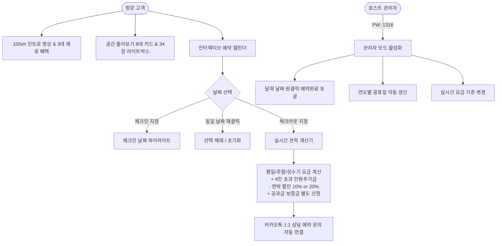

# 🏝️ 제주 희스테이(HEESTAY) 홈페이지 제작 과정 & 운영 매뉴얼 완전 가이드

본 문서는 **제주 성산 단독 풀빌라 '희스테이(HEESTAY)'** 반응형 원페이지 웹사이트의 **기획, 디자인, 기능 구현, 전체 제작 히스토리, 호스트 운영 방법**, 그리고 **추후 신규 제작이나 복원 시 필요한 AI 실행 프롬프트 및 CLI 명령어**를 집대성한 공식 마스터 가이드입니다.

---

## 📌 목차
1. [프로젝트 개요 및 핵심 스펙](#1-프로젝트-개요-및-핵심-스펙)
2. [전체 제작 과정 및 진화 히스토리 (1단계 ~ 10단계)](#2-전체-제작-과정-및-진화-히스토리)
3. [핵심 기능 및 시스템 아키텍처](#3-핵심-기능-및-시스템-아키텍처)
4. [호스트 운영 및 관리 매뉴얼](#4-호스트-운영-및-관리-매뉴얼)
5. [다음에 다시 제작할 때 필요한 AI 실행 프롬프트 (프롬프트 템플릿)](#5-다음에-다시-제작할-때-필요한-ai-실행-프롬프트)
6. [개발·배포·도메인 필수 명령어 모음](#6-개발배포도메인-필수-명령어-모음)
7. [법적 주의사항 및 금지 규칙 (필독)](#7-법적-주의사항-및-금지-규칙)

---

## 1. 프로젝트 개요 및 핵심 스펙

- **숙소명**: 희스테이 (HEESTAY)
- **부제**: Jeju Private Poolvilla (단독주택 감성 풀빌라)
- **위치**: 제주특별자치도 서귀포시 성산읍 온평하산로 79
- **공간 규모**: 대지 130평 / 2층 연면적 40평 단독 건물 (마당 및 돌담 완비)
- **공간 구성**:
  - **1층**: 패밀리 거실, 풀옵션 주방, 6인용 원목 식탁, 침실 2개(각 퀸베드), 독립 욕실 1실, 세탁실(세탁기/건조기)
  - **2층**: 마스터 침실(퀸 1개 + 슈퍼싱글 1개), 파우더룸(화장대), 전용 독립 욕실 1실, 야외 전망 테라스
  - **야외**: 단독 야외 수영장(온수 가능), 프라이빗 노천 온수 자쿠지, 사계절 독립 바베큐 썬룸, 프라이빗 잔디마당
- **수용 인원**: 기본 4인 기준 / 최대 9인 투숙 가능 (퀸 3개 + 슈퍼싱글 1개 + 8~9인용 추가 침구 구비)
- **최소 숙박**: 3박 이상 예약 가능 (7박 이상 10%, 14박 이상 15%, 28박 이상 20% 연박 할인)
- **핵심 차별점**:
  1. 수영장 온수 공급비 0원 / 노천 자쿠지 0원 / 사계절 바베큐장 대여 0원 (시설 추가금 제로)
  2. 공과금(수도, 가스, 전기) 마진 없는 100% 투명 실비 정산 후 퇴실 시 보증금 환급

---

## 2. 전체 제작 과정 및 진화 히스토리

### [1단계] 벤치마킹 및 기초 정보 수집
- 제주 성산 및 독채/단독 풀빌라 트렌드 분석
- 제주모도 이용안내 가이드(guide-on.html) 분석을 통한 공과금 실비 세부 기준, 분리수거, 클린하우스, 주변 맛집·관광지 정보 수집

### [2단계] 디자인 컨셉 수립 및 3대 시안 제작
- **Type A (선정안)**: 네추럴 웜 미니멀리즘 (Warm Stone & Sand 모던 감성)
- **Type A v2**: 건축 아키텍처 스타일
- **Type B**: 매거진 에디토리얼 스타일
- 직관적인 사용자 경험과 모바일 최적화를 위해 **Type A**를 최종 채택하여 고도화 착수

### [3단계] 메인 100vh 풀스크린 인트로 비디오 배경 구축
- 접속 즉시 제주의 정취가 시원하게 느껴지도록 100vh 풀스크린 비디오 배경 탑재
- `heestay-intro-movie.mp4`를 통한 무음 자동재생(`autoplay muted loop playsinline`)
- 타이틀에 **"수영장 · 자쿠지 · 바베큐 추가 비용 없음"** 플로팅 뱃지와 감성 카피 자연스럽게 결합

### [4단계] 3대 제로 혜택 및 투명 공과금 실비 체계 전면 배치
- 타 숙소에서 5~10만원씩 부과하는 수영장 온수 세팅비, 자쿠지 사용료, 그릴 대여료 전액 무료화 강조
- 실제 계량기 검침을 통한 투명 실비 체계(상수도 톤당 약 600원, LPG가스 루베당 약 5,080원, 전기 1일 5,000원) 정립

### [5단계] 34장 고화질 사진 데이터베이스 & 균일 8개 공간 갤러리 완성
- 34장의 공간별 고화질 사진을 데이터 객체(`ALL_PHOTOS`)로 완벽 매핑
- 불균형하던 야외 수영장 카드를 다른 공간 카드와 동일한 `aspect-[4/3]` 규격으로 통일
- **총 8개 균형 카드** 구축:
  1. 야외 풀장 & 노천 자쿠지 (8장)
  2. 사계절 바베큐 썬룸 (2장)
  3. 1층 패밀리 거실 (5장)
  4. 풀옵션 주방 & 다이닝 (6장)
  5. 3개 침실 & 파우더룸 (4장)
  6. 2층 야외 전망 테라스 (4장)
  7. 외관 & 잔디마당 (3장)
  8. 1·2층 독립 욕실 (2장)

### [6단계] 프리미엄 라이트박스 뷰어 (좌우 슬라이드 & 34장 스크롤 썸네일 바)
- 개별 사진 클릭 시 고해상도 모달 오픈
- **좌우 화살표 버튼(◀ / ▶)** 및 키보드 방향키(`←`, `→`, `ESC`) 지원
- 상단 `[ 01 / 34 ]` 카운터 표시
- 하단에 34장 사진이 가로로 펼쳐지는 **미니 썸네일 스크롤 스트립** 구현 (마우스 휠이나 터치로 스크롤하여 원하는 사진으로 즉각 점프)

### [7단계] 네이버 달력 공식 공휴일 반영 및 인터랙티브 캘린더 엔진 개발
- 2025~2028년 대한민국 법정 공휴일 및 대체공휴일, 설날·추석 연휴 완벽 내장
- 공휴일 및 공휴일 전날은 주말 요금(210,000원) 자동 반영

### [8단계] 관리자(Host) 전용 원클릭 운영 시스템
- 관리자 비밀번호: `1316`
- 달력 날짜 클릭 한 번으로 `예약완료(빨간 줄/취소선) ↔ 예약가능` 즉각 토글
- 연도별 공휴일 원클릭 동기화 및 수동 공휴일 추가/삭제
- 요금 설정 모달(평일/주말/성수기/인원추가/보증금 기준) 실시간 변경 및 LocalStorage 저장

### [9단계] 지능형 실시간 견적기 (인원 추가 및 'N박 N+1일' 표기)
- 기본 4인 기준, 최대 9인까지 인원 선택 드롭다운
- 4인 초과 시 1인 1박당 +10,000원 자동 연산
- 숙박 기간을 `8박 9일` 형태로 명확하게 표기
- 3박 미만 시 친절한 예약 제한 알림
- 예상 숙박비 아래에 보증금 별도 분리 및 "공과금(전기·수도·가스) 실비 차감 후 환급해 드립니다." 한 줄 요약

### [10단계] 상단 메뉴 5대 핵심 통합 & 풀옵션 시설 콤팩트화
- 최상단 네비게이션을 5개로 정갈하게 통합 (`공간 둘러보기`, `이용요금 & 예약`, `풀옵션 구비시설`, `이용안내 & 공과금`, `주변여행 & 위치`)
- 길었던 구비시설 섹션을 요금/달력 아래로 이동하고 세련된 4열 콤팩트 카드로 압축

---

## 3. 핵심 기능 및 시스템 아키텍처



---

## 4. 호스트 운영 및 관리 매뉴얼

### 1) 관리자 모드 로그인 방법
1. 브라우저에서 `index.html`을 열고 페이지 맨 아래 푸터(Footer) 영역의 우측 **[관리자 로그인]** 버튼(또는 영문 로고)을 클릭합니다.
2. 비밀번호 입력창에 **`1316`**을 입력하고 확인을 누릅니다.
3. 달력 상단에 검은색 **[🛠️ 관리자 편집 모드 작동 중]** 상태 바가 나타납니다.

### 2) 예약 일정 등록 및 취소 (초간편 원클릭)
- **예약 완료 처리**: 달력에서 손님이 예약한 날짜를 클릭하면 즉시 빨간색 취소선(`예약완료`)으로 전환됩니다.
- **예약 취소(다시 예약가능)**: 예약완료된 빨간 날짜를 다시 클릭하면 즉시 흰색(`예약가능`)으로 복구됩니다.
- 모든 예약 내역은 브라우저의 `HEESTAY_BOOKED_DATES`에 자동 저장되며, 새로고침해도 그대로 유지됩니다.
- **예약 목록 복사**: 관리자 바의 `[📋 예약목록 복사]`를 누르면 예약된 모든 날짜가 클립보드에 복사되어 카카오톡이나 엑셀에 붙여넣을 수 있습니다.

### 3) 공휴일 및 명절 연휴 관리
- 관리자 바의 **[📅 공휴일 관리]** 버튼 클릭
- **[2026년 갱신 (추천)]** 또는 **[전체 연도 동기화]** 클릭 시 설날, 추석, 대체공휴일이 즉시 달력에 빨간 날로 자동 반영됩니다.
- 새로운 임시공휴일이 지정된 경우, 날짜와 이름을 입력하고 `[추가]`를 누르면 즉시 달력에 등록됩니다.

### 4) 숙박 요금 기준 변경
- 관리자 바의 **[⚙️ 요금 설정]** 버튼 클릭
- 평일 요금(기본 190,000원), 주말 요금(기본 210,000원), 인원 추가비(1인 1박 10,000원), 보증금 기준 등을 변경하고 `[설정 저장]`을 누르면 실시간 견적기에 즉시 반영됩니다.

---

## 5. 다음에 다시 제작할 때 필요한 AI 실행 프롬프트

만약 사이트를 처음부터 다시 구축하거나 다른 펜션/풀빌라 사이트로 응용 복제하고 싶을 때, AI 코딩 어시스턴트(Antigravity, Cursor, Claude 등)에게 아래 프롬프트를 복사하여 그대로 입력하십시오.

````markdown
[제주 단독 풀빌라 원페이지 웹사이트 제작 요청 프롬프트]

너는 최고급 웹 디자인과 프론트엔드 엔지니어링 전문가야.
제주 성산에 위치한 130평 대지 위 40평 2층 단독 풀빌라 '희스테이(HEESTAY)'를 위한 고품격 반응형 원페이지 랜딩 페이지(index.html 단일 파일)를 제작해줘.

■ 핵심 디자인 및 기술 원칙:
1. 단일 HTML 파일 내에 Tailwind CSS(CDN), 모던 폰트(Pretendard 및 serif), Vanilla JavaScript 완비
2. 네추럴 웜 미니멀리즘 (Warm Stone & Sand 컬러 톤, 무채색 라인 아이콘, 과도한 이모지 배제)
3. 메인 히어로: 100vh 풀스크린 비디오 배경 (source: heestay-intro-movie.mp4, 자동재생, 무음, 루프)
   - 메인 타이틀: "머묾, 그 자체가 온전한 쉼이 되는 곳"
   - 타이틀 상단 뱃지: "수영장 · 자쿠지 · 바베큐 | 추가 비용 없음" 플로팅 뱃지
4. 절대 준수 법적 규칙: 농어촌민박업 관련 '독채' 단어 일체 사용 금지 ('단독주택', '단독 풀빌라'로만 표기)

■ 필수 섹션 구성:
1. 상단 헤더: 브랜드 로고, 5대 압축 메뉴(공간 둘러보기, 이용요금 & 예약, 풀옵션 구비시설, 이용안내 & 공과금, 주변여행 & 위치), 카카오톡 상담 버튼
2. 3대 무료 혜택: 수영장 온수비 0원, 노천 자쿠지 0원, 독립 썬룸 바베큐장 그릴 대여 0원 강조
3. 공간 둘러보기 (34장 사진 & 8개 동일 규격 카드 그리드):
   - 야외 풀장&자쿠지(8장), 썬룸 바베큐(2장), 거실(5장), 주방&다이닝(6장), 침실 3개(4장), 2층 테라스(4장), 외관 마당(3장), 욕실 2실(2장)
   - 사진 클릭 시 라이트박스 뷰어: 좌우 이동 버튼(◀, ▶), 키보드 방향키, 상단 카운터 [01/34], 하단 34장 가로 스크롤 썸네일 스트립
   - '사진 전체보기 (34장)' 클릭 시 상하 스크롤 그리드 모달 제공
4. 이용 요금 & 연박 할인:
   - 평일 19만원, 금·토·공휴일 21만원, 기본 4인 기준(최대 9인, 4인 초과 시 1인 1박 +1만원)
   - 7박 이상 10%, 14박 이상 15%, 28박 이상 20% 할인 / 기본 3박 이상 예약 가능
5. 인터랙티브 예약 달력 & 실시간 견적기:
   - 대한민국 공식 공휴일(네이버 달력 기준 설날, 추석 연휴 포함) 빨간날 자동 반영
   - 날짜 클릭 시 체크인/체크아웃 지정, 이미 선택된 날짜 재클릭 시 선택 취소(초기화)
   - 중간에 예약된 날짜가 포함된 구간 클릭 시 알림 후 해당 날짜로 새 체크인 자동 전환
   - 숙박 기간을 '8박 9일' 형태로 표기
   - 실시간 예상 숙박비 산출 및 하단에 "공과금(전기·수도·가스) 실비 차감 후 환급해 드립니다." 와 함께 보증금 별도 표시
   - 관리자 모드(PW: 1316): 원클릭 예약완료 ↔ 예약가능 토글, 공휴일 연도별 동기화, 요금 설정
6. 풀옵션 구비시설 (달력 하단 4열 콤팩트 카드):
   - 가전, 주방, 침실/욕실, 야외레저 4개 박스로 깔끔 요약
7. 이용안내 & 공과금 실비 세부 기준:
   - 입실 16:00 / 퇴실 11:00 (비대면 도어록 비밀번호: 예약자 전화번호 뒷자리 4자리 자동 세팅)
   - 상수도(톤당 600원), LPG가스(루베당 5,080원), 전기(1일 5,000원) 실비 기준표
   - 온평리 분리수거 및 클린하우스 이용법
8. 주변 맛집 & 관광지:
   - 온평포구, 성산일출봉, 섭지코지, 빛의 벙커 및 로컬 추천 맛집
9. 오시는 길 & 카카오톡 예약 상담 CTA 버튼
````

---

## 6. 개발·배포·도메인 필수 명령어 모음

### 1) 로컬 개발 및 변경사항 동기화 (PowerShell)
```powershell
# 작업 폴더 이동
cd "c:\nas\mj\비즈니스\유튜브-SNS-캐릭터-애니\ai사이트\AI-mj공작실\01-Nova-Web-Studio\jejuheestay"

# 작업 파일(index.html)을 백업 시안(typeA_minimal.html)으로 동기화 복사
Copy-Item -Path ".\index.html" -Destination ".\typeA_minimal.html" -Force

# 법적 금지어 '독채' 단어 유입 검사 (결과가 없어야 정상)
Select-String -Path ".\index.html", ".\typeA_minimal.html" -Pattern "독채"
```

### 2) Git 커밋 및 GitHub 원격 저장소 푸시
```bash
# 1. 파일 변경사항 확인
git status

# 2. 변경 파일 전체 스테이징 (.gitignore에 의해 100MB 초과 영상은 자동 제외됨)
git add .

# 3. 커밋 생성
git commit -m "feat: update Jeju Heestay landing page and booking system"

# 4. GitHub 원격 저장소 최초 연결 (저장소 생성 후 1회만 실행)
git remote add origin https://github.com/adoptercokr/jejuheestay.git

# 5. 원격 저장소로 Push (main 브랜치)
git push -u origin main
```

### 3) Vercel 배포 & 도메인 DNS 설정 값
- **Vercel CLI 배포 절대 금지** (Windows 터미널 멈춤 버그 방지) -> GitHub `git push`를 통한 자동 배포(Auto Deploy)만 사용
- 도메인 구매처(가비아, 호스팅케이알 등) DNS 설정:

| 레코드 타입 | 호스트 (Host) | 값 (Value / IP Address) |
| :--- | :--- | :--- |
| **A 레코드** | `@` (또는 빈칸) | `76.76.21.21` |
| **CNAME 레코드** | `www` | `cname.vercel-dns.com.` |

---

## 7. 법적 주의사항 및 금지 규칙 (필독)

1. **'독채' 단어 일체 사용 금지**:
   - 농어촌민박업 법률 및 지자체 단속 지침에 따라 '독채 펜션', '독채 숙소' 등 '독채' 단어는 법적 리스크가 발생할 수 있습니다.
   - 사이트 내 모든 문구는 **'단독주택', '단독 풀빌라', '프라이빗 단독 빌라'**로만 표기해야 합니다.

2. **100MB 초과 대용량 파일 GitHub 푸시 금지**:
   - GitHub는 단일 파일 100MB 제한이 있습니다.
   - 구버전 183MB 영상(`jejuheesatay-movie.mp4`)은 반드시 `.gitignore`에 등록하여 푸시에서 제외하고, 68MB 신규 영상(`heestay-intro-movie.mp4`)만 업로드해야 푸시 에러가 발생하지 않습니다.

3. **Vercel CLI 로컬 배포 금지**:
   - 로컬 터미널에서 `npx vercel` 명령어를 직접 치지 마십시오.
   - 오직 GitHub에 코드를 `git push`하여 Vercel 클라우드가 자동 감지하여 배포하도록 유지하십시오.

---
*가이드 작성일: 2026-09-29*  
*관리 및 지원: AI-mj공작실 (Nova Web Studio)*
